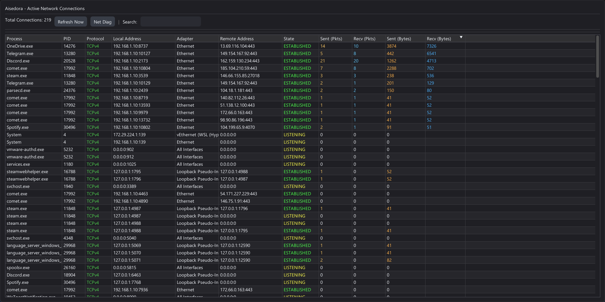

# 🛡️ Aisedora Network Monitor

**Aisedora** is a professional-grade, open-source network text monitoring tool for Windows, built with **modern C++20** and **Dear ImGui**. It combines the ease of use of TCPView with the power of kernel-level packet inspection.

Unlike standard system tools, Aisedora utilizes the **WinDivert** driver to intercept and analyze network traffic in real-time, providing byte-perfect accuracy for both Sent/Received data and packet counts.

<p align="center">
  
</p>

---

## ✨ Key Features

*   **🚀 Real-Time Connection Tracking**: Instantly view all active TCP and UDP connections, mapped to specific processes (PID) and Adapter names.
*   **📊 Precise Traffic Analytics**: Counts actual bytes and packets on the wire. No estimation.
*   **🎨 Modern Dark UI**: A completely custom, responsive, and GPU-accelerated interface featuring:
    *   Dracula-inspired dark theme.
    *   Smooth inertial scrolling with pixel-perfect text rendering.
    *   One-click sorting and filtering.
*   **🔬 Packet Inspector**: Click any connection to view a live hex dump of recent packets (Headers & Payload).
*   **🛠️ Pktmon Integration**: Includes a built-in GUI wrapper for the **Windows Packet Monitor (pktmon)** tool, allowing for deep system diagnostics and drop-reason analysis without touching the command line.
*   **⚡ Zero-Dependency Setup**: The build system automatically downloads and configures all required libraries (GLFW, ImGui, WinDivert).

---

## 💻 System Requirements

*   **OS**: Windows 10 or Windows 11 (64-bit).
*   **Privileges**: **Administrator rights** are required to load the network driver and capture traffic.
*   **Build Tools**: Visual Studio 2022 (or any C++20 compliant compiler) + CMake 3.20+.

---

## 🛠️ How to Build

Aisedora uses a modern CMake workflow. You do not need to manually install ANY libraries.

1.  **Clone the repository**:
    ```powershell
    git clone https://github.com/yourusername/Aisedora.git
    cd Aisedora
    ```

2.  **Generate Project**:
    ```powershell
    mkdir build
    cd build
    cmake ..
    ```

3.  **Compile**:
    ```powershell
    cmake --build . --config Release
    ```
    *The build process will automatically fetch the WinDivert driver and placing the required `.sys` and `.dll` files next to the executable.*

---

## 🚀 How to Run

1.  Navigate to the output directory (usually `build/bin/Release`).
2.  Right-click **`Aisedora.exe`**.
3.  Select **"Run as Administrator"**.

> **Note**: If you do not run as Admin, the application will fail to initialize the monitoring engine as it cannot access the network stack.

---

## 📚 Technical Details

Aisedora is built on a robust stack:
*   **Core**: C++20 (Smart pointers, multithreading, filesystem).
*   **UI Framework**: [Dear ImGui](https://github.com/ocornut/imgui) (Docking branch) with GLFW & OpenGL 3.
*   **Network Driver**: [WinDivert 2.2](https://github.com/basil00/Divert) (Windows Packet Divert).
*   **System API**: Windows IP Helper API (IPHLPAPI), Winsock2, Pktmon ETW.

---

## ⚠️ Disclaimer

This tool interacts with the Windows Network Stack at a low level. While safe, it is intended for educational and diagnostic purposes. Always ensure you have permission to monitor network traffic on the machine you are using.
